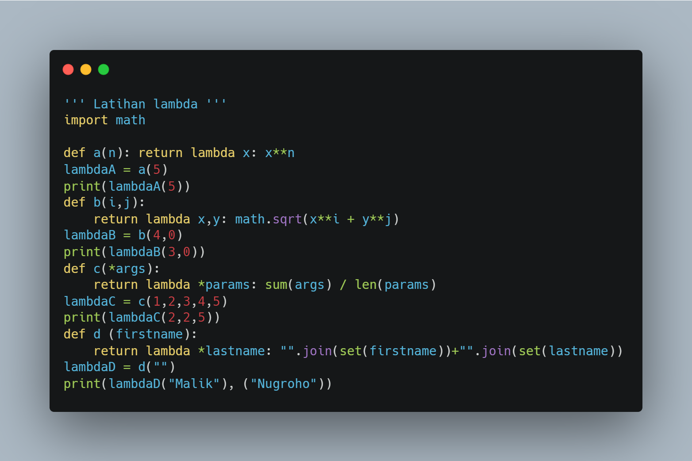
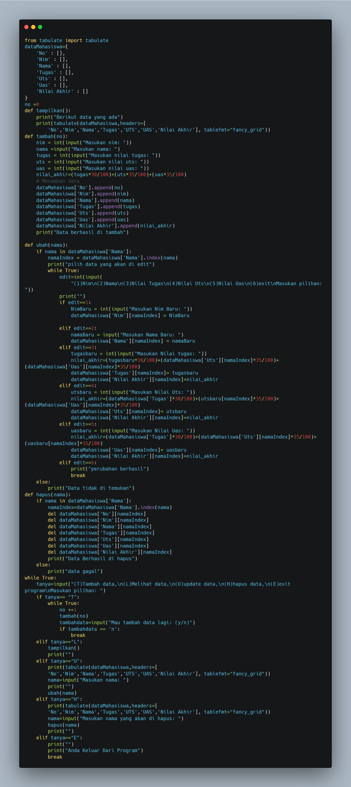

# Praktikum 7 Pengenalan fungsi
* buatlah file di python dengan nama praktikum7.py 
  kita masuk ke latihan praktikum 7, tulis seperti code di bawah ini

  

  * di bawah ini adalah hasil dri print outnya

# Praktikum 7
* kita akan membuat program sederhana dengan fungsi
* berikut contoh code program sederhana dengan fungsi

# edit data beradasarkan nama

# Tambah data

# Hapus data

# selesai program dari saya, terima kasih